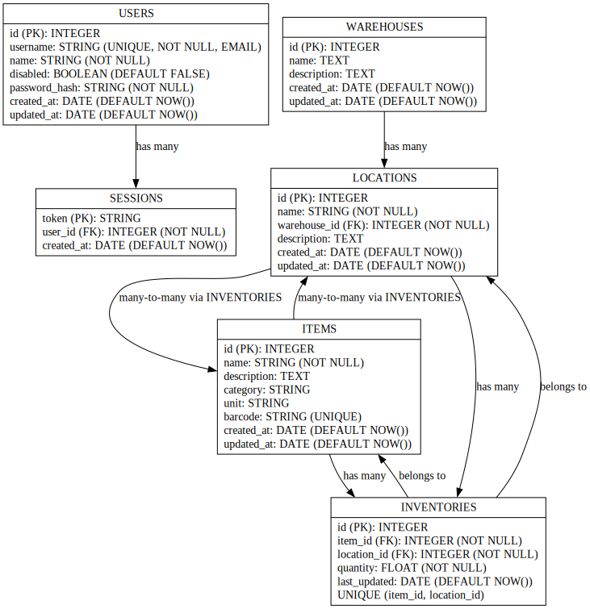

## Simple Web-based Warehouse Management Application (work in progress)

Web based application for simple warehouse inventory managment (currently with very limited functionalities). It is designed to help manage item locations and inventory in small business and househoulds that dont need complicated ERP like applications.

Barcode reading is supported with devices camera. This uses primarly -Barcode Reading- from Web API, if browser does not support this, polyfill is used (barcode-detector (git-hub.com/Sec-ant/barcode-detector))

### Core Functionalities

- User can create, login and edit their account.
- User can create/edit/delete Warehouses, Locations, Items and Inventories.
- User can list all their items and filter those by name. Item list shows items with their inventories and locations. Item can be found with barcode or by name.
- User can use devices camera to read barcodes, and add them to item information.

### Main Technologies Used:

    Backend: Node.js with Express. Sequalize to use Postgres database.
    Frontend: React.js
    Database: PostgreSQL

### Installation steps for deveploment:

#### prerequisites:

- postgreSQL database

#### install /backend:

    npm install

#### install /frontend:

    npm install

#### run local servers for deveploment:

    /backend: npm run dev
    /frontend: npm run dev

#### .env

/backend/.env should hold:

- DATABASE_URL
- TEST_DATABASE_URL // tests not done ATM
- PORT // Server port
- SECRET // json web token secret

### REST APIs:

check /backend/routes/

### Database Schema:

### Mixed notes:

- User model has field -disabled-(defaults to false when creating user). There is no API-endpoint to change it, so it can only be changed by connecting to the database.

#### //TODO:

- User can change location of inventory (move Inventory)
- More unified way to handle errors in frontend (from requests to backend api), and a way to show that error to user.

##### Bigger goals for project, but will likely not be implemented in near future

- Order management and processing (full order-handling workflow)
- Goods receiving and shipping operations
- Creation of purchase proposals
- Picking functions (order picking / stock picking tasks)
- Inventory counting (physical inventory / stock-taking)
